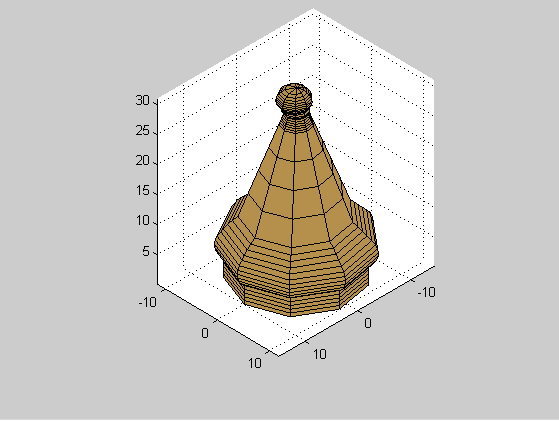

# Approximation of 3D object using different methods (file `u1.m`)

## Before approximation

### Original model

### Sparse mesh

### Desnse mesh

## After approximation

### Lagrange interpolation

### Global splines interpolation

### NURBS approximation

