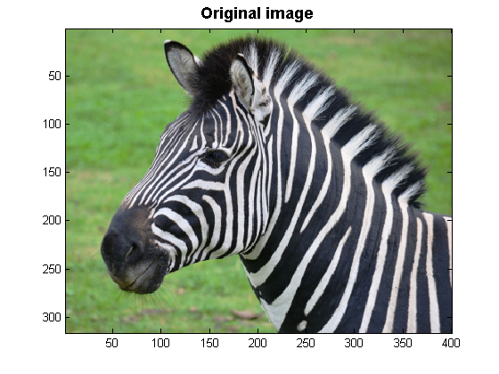
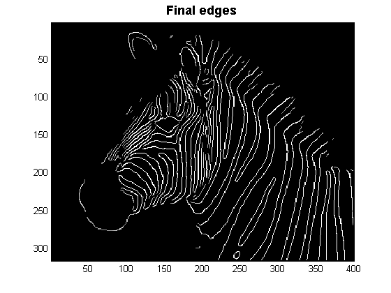

# Canny edge detector
This is a Matlab code for Canny edge detector

Image of a zebra is taken from [National Geographic page](http://yourshot.nationalgeographic.com/u/ss/fQYSUbVfts-T7pS2VP2wnKyN8wxywmXtY0-FwsgxpiqyNKL7Je1Nr0Esnfaf8Wark8ljxtPgUhOmMfC6J1sX/).